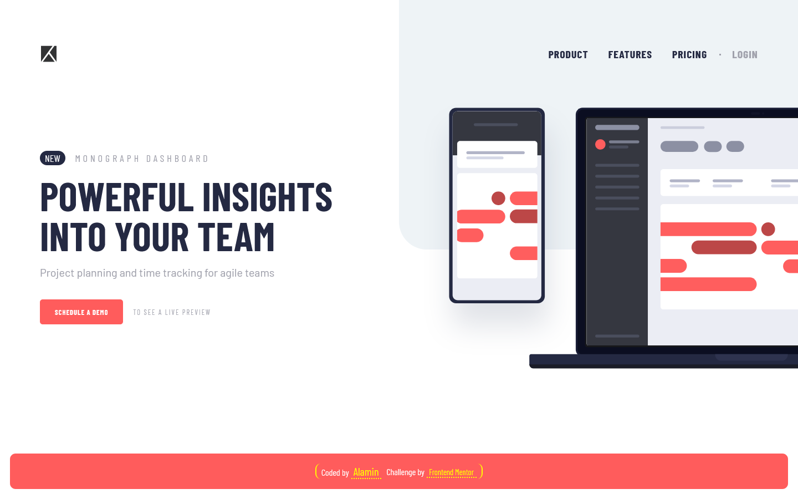

<h1 align="center">Project tracking intro component</h1>
<div align="center">

Challenge from [Frontend Mentor](https://www.frontendmentor.io/profile/CodeWithAlamin)

</div>

<h2 align="center">

[🚀Live Site](https://project-tracking-intro-alamin.netlify.app/)
|
[💡Frontend Mentor](https://www.frontendmentor.io/solutions/responsive-project-tracking-intro-component-nrBDDE7zbl)

</h2>

<p align="center">
A minimalist project tracking intro component created as a practice project from FrontendMentor. This solution was built using HTML, CSS, and JavaScript, showcasing responsive design and frontend development skills.
</p>

<a align="center" href="https://project-tracking-intro-alamin.netlify.app/">



</a>

## The challenge

Users should be able to:

- View the optimal layout for the site depending on their device's screen size
- See hover states for all interactive elements on the page
- Create the background shape using code

## Built with

- Semantic HTML5 markup
- Mobile-first workflow
- CSS custom properties
- CSS Grid
- JavaScript
- NPM
- [Webpack - a module bundler](https://webpack.js.org/)

## Installation

- Clone this repo:

```sh
git clone https://github.com/CodeWithAlamin/Project-tracking-intro-component.git
```

- Install dependencies:

```sh
npm install
```

- Build command:

```sh
npm run build
```

- Live server:

```sh
npm start
```

## Author

<b>👤 Alamin</b>

- Twitter - [@CodeWithAlamin](https://www.twitter.com/CodeWithAlamin)
- LinkedIn - [@CodeWithAlamin](https://www.linkedin.com/in/CodeWithAlamin)
- Frontend Mentor - [@CodeWithAlamin](https://www.frontendmentor.io/profile/CodeWithAlamin)
- Github: [@CodeWithAlamin](https://github.com/CodeWithAlamin)

Feel free to contact me with any questions or feedback!

## Show your support

Give a ⭐️ if you liked this project!

## Acknowledgments

Special thanks to Frontend Mentor for providing such an amazing platform to practice and improve my frontend skills. The challenges and projects available on the website were both fun and challenging, and helped me learn a lot in a short amount of time.

## License

This project is licensed under the [MIT](https://github.com/CodeWithAlamin/Project-tracking-intro-component/blob/main/LICENSE.md) license, which means you can use, modify, and distribute the code as you wish. If you have any questions or feedback, feel free to reach out. Thank you for considering my code!
